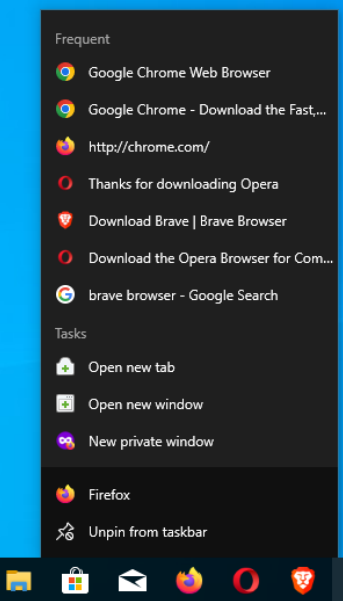
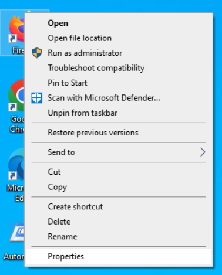
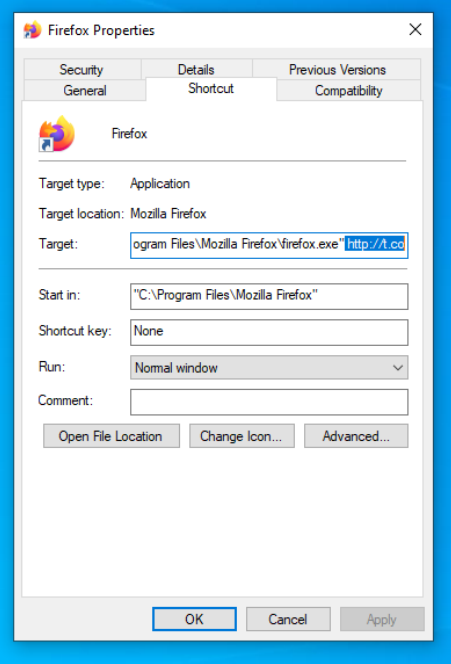
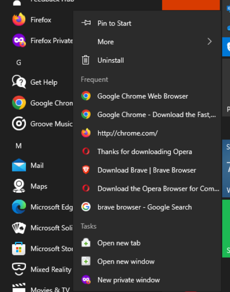
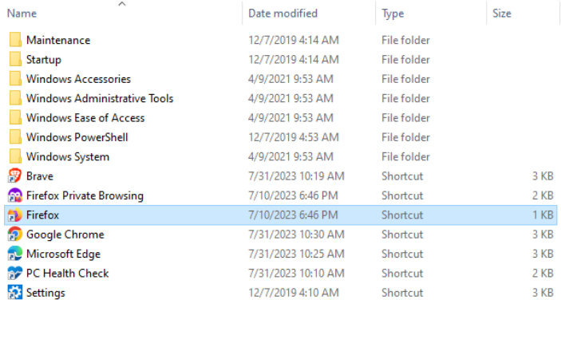
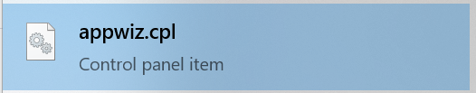
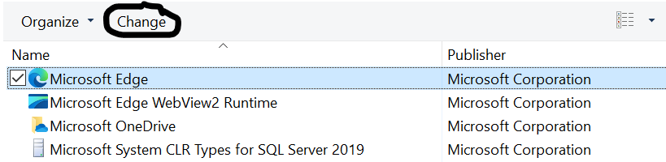

## Fix changes to your browser caused by malware
Now days, it is common for malware to make unwanted modifications to your browser. This guide should help remove a few of the most common types.

Warning: This is a work in progress!

## Notice!
This page has been moved to https://iam-py-test.github.io/malware_removal.html

### Things not to do
- Do not use "cleaner" programs to clear browser cache/cookies. These programs may cause problems with your browser. Use your browser settings to clear cookies and cache.
- Stay aware from scam or low quality malware removal tools, such as SpyHunter, TotalAV, ScanGuard, and PCProtect.

### Remove spam notifications
Malicious websites can send you spammy notifications, such as fake warnings about malware:  

Revoke the ability to send notifications for all but sites which need it and which you trust:
- Chrome: https://support.google.com/chrome/answer/114662 (under Learn about permissions that can be changed, then scroll down)
- Firefox: https://support.mozilla.org/kb/push-notifications-firefox#w_how-do-i-revoke-web-push-permissions-for-a-specific-site 
- Firefox for Android: https://support.mozilla.org/kb/manage-notifications-firefox-android
- Firefox Focus for Android: https://support.mozilla.org/kb/change-site-permissions-firefox-focus-android
- Edge: https://products.support.services.microsoft.com/microsoft-edge/manage-website-notifications-in-microsoft-edge-0c555609-5bf2-479d-a59d-fb30a0b80b2b
- More information: https://www.malwarebytes.com/blog/news/2019/01/browser-push-notifications-feature-asking-abused

If that does not work or you want to be sure, [clear your browser cache and site data](#clear-browser-cache-and-cookies), which should remove the code which is causing these issues.  

### Clear browser cache and cookies
**Warning: This will sign you out of websites** 
- Firefox: https://support.mozilla.org/kb/clear-cookies-and-site-data-firefox
- Chrome: https://support.google.com/accounts/answer/32050
- Edge: https://support.microsoft.com/microsoft-edge/delete-cookies-in-microsoft-edge-63947406-40ac-c3b8-57b9-2a946a29ae09 (chose "delete all cookies")
- Safari on MacOS: https://www.howtogeek.com/242324/how-to-clear-safari-browsing-history-and-cookies-on-mac/ (scroll down to "How to Clear Your Cookies on Safari". You don't need to delete your history)
- Safari on iOS: https://support.apple.com/HT201265

### Change search engine and homepage/new tab
Some malware will only change your homepage/new tab or search engine, and will not prevent you from changing it back. 
Homepage/new tab:
- Firefox: https://support.mozilla.org/kb/how-to-set-the-home-page
- Firefox for iOS: https://support.mozilla.org/kb/set-homepage-firefox-ios
- Chrome: https://support.google.com/chrome/answer/95314
- Edge: https://support.microsoft.com/microsoft-edge/change-your-browser-home-page-a531e1b8-ed54-d057-0262-cc5983a065c6 (also has steps for other browsers, but they may not be up-to-date)
 

Search engine:
- Firefox: https://support.mozilla.org/kb/change-your-default-search-settings-firefox
- Firefox Focus on Android: https://support.mozilla.org/kb/change-your-default-search-firefox-focus-android
- Chrome: https://support.google.com/chrome/answer/95426
- Edge: https://support.microsoft.com/microsoft-edge/change-your-default-search-engine-in-microsoft-edge-cccaf51c-a4df-a43e-8036-d4d2c527a791

 If your browser says the homepage or search engine is managed by an extension, follow [the instructions below to uninstall that extension](#uninstall-a-specific-extension). If that does not work, try [resetting browser sync](#reset-browser-sync) and [removing policies (Windows only)](#remove-browser-policies-windows).

### Uninstall a specific extension
If a specific extension is causing problems, you can uninstall it: 
- Firefox: https://support.mozilla.org/kb/disable-or-remove-add-ons
- Firefox for Android: https://support.mozilla.org/kb/uninstall-firefox-android-add-ons
- Chrome: https://support.google.com/chrome_webstore/answer/2664769
- Edge: https://support.microsoft.com/microsoft-edge/add-turn-off-or-remove-extensions-in-microsoft-edge-9c0ec68c-2fbc-2f2c-9ff0-bdc76f46b026

#### Can not remove an extension:
- Firefox: https://support.mozilla.org/kb/cannot-remove-add-on-extension-or-theme
- Chrome:
    - [Reset browser sync](#reset-browser-sync)
    - [Remove malware infections](#remove-malware-from-your-system)
    - Remove extensions installed via policy: https://www.howtogeek.com/410270/how-to-remove-a-chrome-extension-installed-by-enterprise-policy-on-windows/

If you are unsure what extensions to uninstall, see if you have [any of the extensions listed below](#known-malware-browser-extensions) installed, and if so, try uninstalling them. You also can try disabling your extensions one-by-one and seeing which one is causing the problem.

#### Known malware browser extensions
If installed, I recommend you remove these. However, this is not an exhaustive  list.
- "Browsing Overview by Securify"
Changes your search engine to `search[.]mysecurify[.]com`, which redirects to Bing.

### General advice on troubleshooting
- Firefox: 
    - https://support.mozilla.org/kb/troubleshoot-firefox-issues-caused-malware
    - https://support.mozilla.org/kb/troubleshoot-and-diagnose-firefox-problems
- Chrome: https://support.google.com/chrome/answer/2765944

### Remove a theme
Themes should not be able to do anything bad, and thus are highly unlikely to be malware. However, should you want to remove them, here is how:
- Chrome: https://support.google.com/chrome_webstore/answer/148695
- Edge: https://www.howtogeek.com/725974/how-to-add-and-remove-themes-in-microsoft-edge/ (unofficial guide, instructions are under "How to Remove or Uninstall Themes from Microsoft Edge")

### Reset browser sync
Many browsers now can sync data between devices. This feature sadly has the side effect of causing unwanted browser changes to reappear, even after being removed. **Be aware that clearing your sync data probably will cause some synced data to be lost. Be sure to save any important data (i.e. passwords) securely outside your browser just in case.** 
- Chrome: https://forums.malwarebytes.com/topic/258886-chrome-secure-preferences-detection-always-returns/
- Edge (didn't find a good online guide):  

How to clear sync data in Edge

<ul>
<li>Open edge://settings</li>
<li>Click "Profiles" in the sidebar</li>
<li>Click "Sync"</li>
<li>Scroll down and click on "Reset sync"</li>
<li>You will be prompted to confirm. Click "reset"</li>
<li>Edge will reset your sync. It may take a short time for it to setup again (no action from you is needed)</li>
</ul>

I do not use sync on Firefox, so not sure this will help at all. Deleting your account will clear all data, but probably isn't ideal.

- Firefox sync: https://support.mozilla.org/kb/delete-sync-data-firefox-signing-out-firefox-

### Remove a proxy
A proxy is another computer or software which sits between you and the website you are accessing. There are many legitimate uses for proxies. However, if you do not use one, you may want to check if one has been set by malware:
- Firefox: https://support.mozilla.org/kb/connection-settings-firefox

### Reset the HOSTs file
GNU/Linux, Windows, MacOS, and many other operating systems nowdays have a special file called the HOSTs file which lets you tell your computer where to find specific websites. This also means you can tell your computer that a website doesn't exist. Many people use this to block ads, trackers, or malware. However, malware can use this to block websites hosting security software.
- Windows: https://support.microsoft.com/topic/how-to-reset-the-hosts-file-back-to-the-default-c2a43f9d-e176-c6f3-e4ef-3500277a6dae

After resetting your HOSTs file, reboot your device.

### Change your DNS server
- Windows: https://www.howtogeek.com/786911/how-to-change-your-dns-server-on-windows-10/
- MacOS: https://www.howtogeek.com/787642/how-to-change-your-dns-server-on-a-mac/
- Possible DNS servers:
    - AdGuard: https://adguard-dns.io/public-dns.html
    - NextDNS: https://my.nextdns.io/setup
        - https://github.com/yokoffing/NextDNS-Config
    - Not recommended:
        - CloudFlare
        - Google

### Fix problems updating
- Chrome: https://support.google.com/chrome/answer/111996
- Firefox: https://support.mozilla.org/kb/update-failed-error-message-when-updating
- [Try reseting your HOSTs file](#reset-the-hosts-file) and [changing your DNS server](#change-your-dns-server)

### Fix hijacked shortcuts (Windows)
If your browser keeps opening unwanted websites, it could be that 
#### Method 1
This method will delete and recreate the taskbar shortcut.
- Right click on your browser's icon in your taskbar
- Click "Unpin from taskbar":  
 
- Search for your browser in Windows search or open it via another method (i.e. a desktop shortcut)
- Once it opens, right click on it's icon in the taskbar and click "Pin to taskbar":  
 

#### Method 2
This method will clean any shortcuts in your desktop.
- Right click on the desktop shortcut
- Click "Properties"
  
- Click the "Target" box and delete everything after the name of the browser and the last double-quote:
  
- Delete all the selected text. Remember: Do not delete anything before the double-quote and browser name
- Click "Apply"
- If you get this error, click "Continue" and accept the UAC prompt if needed
  

### Method 3
- Open the start menu
- Find your browser
- Right click on it:
  
- Hover over "More" and click "Open file location":
  
- Right click on the shortcut (Windows should already select the proper shortcut)
  
- Click "Properties"
  
- Click the "Target" box and delete everything after the name of the browser and the last double-quote:
  
- Delete all the selected text. Remember: Do not delete anything before the double-quote and browser name
- Click "Apply"
- If you get this error, click "Continue" and accept the UAC prompt if needed
  

### Remove malware from your system
No one malware removal tool can clean a system.
- Windows:
    - All of these programs are free. Some may advertise their payed software, but it is not needed
    - Sadly, none of these are libre software
    - If you are unable to download this software:
        - [Try resetting your HOSTs file](#reset-the-hosts-file)
        - [Change your DNS server](#change-your-dns-server)
        - [Remove any browser policies added by the malware](#remove-browser-policies-windows)[[1]](https://infosec.exchange/@iampytest1/110729341478492979)
        - Download and run RKill: https://www.bleepingcomputer.com/download/rkill/
        - Boot into safe mode: https://support.microsoft.com/windows/start-your-pc-in-safe-mode-in-windows-92c27cff-db89-8644-1ce4-b3e5e56fe234
        - Malwarebytes Anti-rootkit: https://forums.malwarebytes.com/topic/198907-requested-resource-is-in-use-error-unable-to-start-malwarebytes/#comment-1114827 (ignore the title)
    - Adwcleaner: https://support.malwarebytes.com/hc/articles/360038520054-Download-and-install-Malwarebytes-AdwCleaner
        - For more information: https://support.malwarebytes.com/hc/articles/360038520114-Malwarebytes-AdwCleaner-scan-and-clean 
        - Do not remove any of the "preinstalled software" unless you know what you are doing; it is **not** malware.
        - About the settings: https://support.malwarebytes.com/hc/en-us/articles/360038520134-Malwarebytes-AdwCleaner-Application-settings
        - Under "Basic repair options", I would recommend you enable "Reset HOSTs file"
        - I would recommend you turn off "usage and threat statistics"
    - Emsisoft Emergency Kit: https://www.emsisoft.com/home/emergency-kit/
        - It is recommended you run the full scan.
        - Be sure to update after installing
    - ESET Online Scanner: https://download.eset.com/com/eset/tools/online_scanner/latest/esetonlinescanner.exe
        - It is recommended to run the full scan
        - ESET automatically removes threats during the scan. [You can restore them if you are sure they are false positives](https://support.eset.com/en/kb2915-restore-files-quarantined-by-the-eset-online-scanner)
    - Norton Power Eraser: https://support.norton.com/sp/en/us/home/current/solutions/kb20100824120155EN
        - No, this is not a joke.
    - Sophos Scan and Clean:
        - 64-bit: https://download.sophos.com/tools/SophosScanAndClean_x64.exe
        - 32-bit: https://download.sophos.com/tools/SophosScanAndClean.exe
        - If these links do not work, you can [download it from here](https://www.sophos.com/free-tools/virus-removal-tool/free-download), but you will have to enter a name and email. You do not have to enter a real email, but they do block obviously invalid ones (i.e. `example@example.example`)
        - Would recommend you go into the settings and turn off "Scan for Tracking Cookies". These are **not malware** and clutter up the scan results. It is better to [manage cookies from your browser's settings](#clear-browser-cache-and-cookies) rather than using 3rd-party tools, and it is even better to block trackers rather than just removing tracking cookies after the fact.
    - Malwarebytes: https://www.malwarebytes.com/mwb-download/thankyou
        - Offline installer: https://downloads.malwarebytes.com/file/mb4_offline
        - You **do not** need to buy it! The free version can remove malware just as well as the paid one.
        - It will come with a trial version:
            - The real-time protection may confict with your security software:
                - You can disactivate the trial: https://support.malwarebytes.com/hc/articles/360040972954-Deactivate-Premium-Trial-in-Malwarebytes-for-Windows
                - You can turn off real-time protection: https://support.malwarebytes.com/hc/articles/360038984793 (if you don't want the real time protection, you are better off disactivating the trial. The only downside is that you will never be able to use the trial again)
                - Or if you want the real time protection (which **is not needed to clean your system**), you can exclude Malwarebytes from your security software and vice versa: https://support.malwarebytes.com/hc/articles/360038522974-Malwarebytes-for-Windows-antivirus-exclusions-list
        - You do not need to do a custom scan of your entire C:\ drive. The threat scan is enough
        - I would strongly recommend you unregister it from the Windows Security Center, as to avoid disabling Windows Defender
        - While the default scan settings are enough for normal usage, I would recommend enabling the "Scan for rootkits" option on infected systems: https://support.malwarebytes.com/hc/articles/360038984953-Security-settings-in-Malwarebytes-for-Windows
        - You can uninstall Malwarebytes once you are done
        - If you want to keep Malwarebytes installed, be sure to reset the scan settings to default.
    - Kaspersky: https://www.kaspersky.com/downloads/free-virus-removal-tool
        - I am not a big fan on Kaspersky, and I know a lot of people distrust them (for various reasons, mostly concerning Russia). However, if you are ok with running their software, their malware removal tool is one of the best.
    - Windows Defender:
        - Before scanning, check for and remove any exclusions: https://support.microsoft.com/en-us/topic/what-are-exclusions-in-windows-security-8b248399-5e63-4a4b-897f-52ea2dddb962#ID0EDF
        - Run a scan: https://www.howtogeek.com/679263/how-to-scan-with-microsoft-defender-antivirus-on-windows-10/
    - Microsoft Safety Scanner: https://learn.microsoft.com/microsoft-365/security/intelligence/safety-scanner-download
        - Be sure to run the Full scan!
        - Be aware that the Microsoft Safety Scanner may show detections during the scan. This is *normal* and does *not* mean you are infected. All that matters is the result at the end.
        - There is no point in running this in addition to Windows Defender
- Android:
    - I have little experence removing malware from Android, and lack an environment to test in. Thus, I do not know what the best security software for Android is.
    - Malwarebytes: https://play.google.com/store/apps/details?id=org.malwarebytes.antimalware
        - It seems you now need to share payment information and agree to the trial, even to do a free scan
    - https://support.google.com/accounts/answer/9924802?co=GENIE.Platform%3DAndroid
- iOS:
    - iOS malware is very rare outside targeted attacks
        - If you are reading a page on GitHub about how to fix problems with your browser, you probably aren't someone who would be targeted.
        - If you are indeed targeted, you should seek help from an expert, not a page on GitHub
    - This is far beyond the scope of this page and my knowledge
    - However, if needed, below is information on reseting an iOS device
    - Reset: https://support.apple.com/guide/iphone/return-iphone-settings-to-their-defaults-iphea1c2fe48/ios
    - Reinstall: https://support.apple.com/guide/iphone/erase-iphone-iph7a2a9399b/16.0/ios/16.0#iph622110a2d

### Fix browsers not opening
- Firefox: try opening Firefox in [Troubleshoot Mode](https://support.mozilla.org/kb/diagnose-firefox-issues-using-troubleshoot-mode)

### Remove browser policies (Windows)
Before doing this, close all browsers.
Open regedit and delete these keys:
- Edge (current user):
    - HKEY_CURRENT_USER\SOFTWARE\Policies\Microsoft\Edge
    - HKEY_CURRENT_USER\SOFTWARE\WOW6432Node\Policies\Microsoft\Edge
- Edge (system) - you will need to run regedit as admin:
    - HKEY_LOCAL_MACHINE\SOFTWARE\Policies\Microsoft\Edge
    - HKEY_LOCAL_MACHINE\SOFTWARE\WOW6432Node\Policies\Microsoft\Edge
- Chrome (current user):
    - HKEY_CURRENT_USER\SOFTWARE\Policies\Google\Chrome
- Chrome (system) - you will need to run regedit as admin:
    - HKEY_LOCAL_MACHINE\SOFTWARE\Policies\Google\Chrome 
- Chrome policy removal tool: `https://www.stefanvd.net/project/chrome-policy-remover/` (there is also one for MacOS, but I cannot speak to its safety or effectiveness)
- Internet Explorer: HKLM\SOFTWARE\Policies\Microsoft\Internet Explorer
- Firefox: HKLM\SOFTWARE\Policies\Mozilla\Firefox

After doing this, restart your browser

### Reset your browser
- Chrome: https://support.google.com/chrome/answer/3296214
    - Chrome (Android): https://malwaretips.com/blogs/how-to-reset-chrome-browser-settings-on-android-phone/
- Firefox: https://support.mozilla.org/kb/reset-preferences-fix-problems
- OperaGX: https://www.youtube.com/watch?v=5rjfyD13-Vk
- Edge (I do not see a good online guide for Edge) 

How to reset Edge

<ul>
<li>Go to edge://settings</li>
<li>Click "Reset settings" in the sidebar</li>
<li>Click "Restore settings to their default values"</li>
<li>You will be prompted to confirm. Click "reset"</li>
<li>Edge will be reset. All extensions will be disabled, but not uninstalled</li>
</ul>

- Internet Explorer: https://support.microsoft.com/windows/change-or-reset-internet-explorer-settings-2d4bac50-5762-91c5-a057-a922533f77d5
- Various browsers: https://www.computerhope.com/issues/ch001748.htm

### Reinstall your browser
#### Uninstall
- Chrome: https://support.google.com/chrome/answer/95319
- Firefox: https://support.mozilla.org/kb/uninstall-firefox-from-your-computer
- Brave: https://support.brave.com/hc/articles/4404876135565-How-do-I-uninstall-Brave-
- Vivaldi: https://help.vivaldi.com/desktop/install-update/how-to-uninstall-vivaldi/
- It is not possible to uninstall Microsoft Edge from Windows. You can, however, install it over your existing install or repair it (below).

#### Repair Microsoft Edge on Windows
- Type appwiz.cpl into the Windows search
- Click on "appwiz.cpl":
  
- Scroll down until you see Microsoft Edge:
  
- Click on it, then click "Change":
  
- Click "repair" and wait
  

#### Reinstall
- Chrome: https://support.google.com/chrome/answer/95346
- Firefox: 
    - Windows: https://support.mozilla.org/kb/how-install-firefox-windows
    - GNU/Linux: https://support.mozilla.org/kb/install-firefox-linux
    - MacOS: https://support.mozilla.org/kb/how-download-and-install-firefox-mac
    - iOS: https://support.mozilla.org/kb/install-firefox-your-ipad-iphone-or-ipod
    - Android: https://support.mozilla.org/kb/install-firefox-your-phone-or-tablet
- Microsoft Edge:
    - [Try repairing it first](#repair-microsoft-edge-on-windows)
    - All devices: https://www.microsoft.com/edge/download

#### Problems installing
- Chrome: https://support.google.com/chrome/answer/6315198

### Dealing with aggressive malware
Before continuing, try all the prior steps. This is the "nuclear" option. It will remove most/all data, so be sure you have anything (passwords, bookmarks) backed up. I do not have good guides for all browsers.
- MacOS (Safari and Chrome): https://forums.malwarebytes.com/topic/236261-how-to-remove-the-after-effects-of-adware/
- Windows/Chrome: https://forums.malwarebytes.com/topic/258938-resetting-google-chrome-to-clear-unexpected-issues/
- Windows/Edge: https://www.tenforums.com/tutorials/159010-how-completely-reset-microsoft-edge-chromium-default-windows.html (**Warning**: ALL data in ALL Edge profiles will be deleted!)
 If there is more than one user on the system, you may need to repeat some of these steps for each user.

### Browser security advice
Once you have fixed your issue, it is recommended to take this advice:
- Install software to block ads. [uBlock Origin is a free (and libre) browser extension which blocks ads, trackers, and malware.](https://github.com/gorhill/uBlock).
    - Only use one ad/content blocker at a time!
- Keep your browser up to date:
    - Firefox: https://support.mozilla.org/kb/update-firefox-latest-release
    - Firefox for Android: https://support.mozilla.org/kb/update-latest-version-firefox-android
    - Chrome: https://support.google.com/chrome/answer/95414
    - Edge (a bit old but should still work): https://www.howtogeek.com/672726/how-to-update-microsoft-edge/
